## 实验二

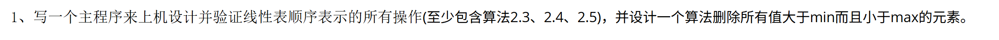

> ​	删除所有大于最小值小于最大值的元素，实际上链表中最终留下的只有最大值和最小值两种数字（当然可能有重复）。只需要遍历链表，当第`i`个位置的元素大于最小值且小于最大值，则删除；否则继续向下遍历。最后打印链表即可。

- **线性表顺序结构所有操作**

```C++
#include<iostream>
using namespace std;
#define OK 1
#define ERROR 0
#define OVERFLOW -1
#define LIST_INIT_SIZE 100
#define LISTINCREMENT 10

typedef int Status;
typedef int ElemType;
// 定义顺序表
typedef struct{
    ElemType *elem; //储存空间
    int length;     //表长
    int listsize;   //存储容量
}SqList;

//创建空顺序表
Status InitList_sq(SqList &L){
    L.elem = (ElemType *)malloc(LIST_INIT_SIZE*sizeof(ElemType));
    if(!L.elem) exit(OVERFLOW);
    L.length = 0;
    L.listsize = LIST_INIT_SIZE;
    return OK;
}

//指定位置插入元素
Status ListInsert_Sq(SqList &L,int i,ElemType e){
    if(i<1 || i>L.length+1) return ERROR;
    if(L.length >= L.listsize){
        ElemType *newbase = (ElemType *)realloc(L.elem,(L.listsize+LISTINCREMENT)*sizeof(ElemType));
        if(!newbase) exit(OVERFLOW);
        L.elem = newbase;
        L.listsize += LISTINCREMENT;
    }
    ElemType *q = &(L.elem[i-1]);   //q为插入位置
    for(ElemType *p = &(L.elem[L.length-1]);p>=q;--p)
        *(p+1) = *p;
    *q = e;
    ++L.length;
    return OK;
}

//指定位置删除元素并返回被删除元素
Status ListDelete_Sq(SqList &L,int i,ElemType &e){
    if(i<1 || i>L.length) return ERROR;
    ElemType *p = &(L.elem[i-1]);   //p为删除位置
    e = *p;
    ElemType *q = L.elem + L.length -1;   
    for(++p;p<=q;++p)
        *(p-1) = *p;
    --L.length;
    return OK;
}

//销毁顺序表
Status DestroyList_sq(SqList &L){
    free(L.elem);
    L.elem = NULL;
    L.length = 0;
    L.listsize = 0;
    return OK;
}

//打印顺序表
void PrintList_Sq(SqList L){
    for(int i = 0;i<L.length;++i){
        printf("%d ",L.elem[i]);
    }
    printf("\n");
}

//获取顺序表最大值
ElemType Get_Max(SqList L){
    if(L.length == 0) return ERROR;
    ElemType max = L.elem[0];
    for(int i = 1;i<L.length;i++){
        if(L.elem[i]>max){
            max = L.elem[i];
        }
    }
    return max;
}

//获取顺序表最小值
ElemType Get_Min(SqList L){
    if(L.length == 0) return ERROR;
    ElemType min = L.elem[0];
    for(int i = 1;i<L.length;i++){
        if(L.elem[i]<min){
            min = L.elem[i];
        }
    }
    return min;
}

int main(){
    SqList L;
    InitList_sq(L);
    printf("初始化顺序表L:");
    PrintList_Sq(L);
    ListInsert_Sq(L,1,9);
    ListInsert_Sq(L,2,19);
    ListInsert_Sq(L,3,3);
    ListInsert_Sq(L,4,7);
    printf("插入元素后顺序表L:");
    PrintList_Sq(L);
    ElemType e;
    ListDelete_Sq(L,2,e);
    printf("删除的元素为:%d\n",e);
    printf("删除元素后顺序表L:");
    PrintList_Sq(L);
    ElemType max = Get_Max(L);
    ElemType min = Get_Min(L);
    printf("顺序表L的最大值为:%d\n",max);
    printf("顺序表L的最小值为:%d\n",min);
    DestroyList_sq(L);
    printf("顺序表L已被销毁\n");
    return 0;
}
```

- **删除顺序表中所有大于min且小于max的元素**

```C++
Status Deleterange_Sq(SqList &L,ElemType min,ElemType max){
    int i = 0;
    while(i<L.length){
        if(L.elem[i]>min && L.elem[i]<max){
            ListDelete_Sq(L,i,L.elem[i]);
        }else ++i;
    }
    return OK;
}
```


---

## 实验三

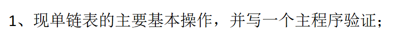

```C++
#include<iostream>
#include<cstdio>
using namespace std;
#define OK 1
#define ERROR 0
#define OVERFLOW -1
#define LIST_INIT_SIZE 100
#define LISTINCREMENT 10

typedef int Status;
typedef int ElemType;

// 单链表的存储结构
typedef struct LNode{
    ElemType data;
    struct LNode *next;
}LNode, *LinkList;

// 创建单链表
void CreateList_L(LinkList &L,int n){
    //逆位输入n个元素
    L =(LinkList)malloc(sizeof(LNode));
    L->next = NULL; // 头指针指向空
    printf("请逆序输入%d个元素: ",n);
    for(int i = n;i>0;--i){
        LNode *p;
        p = (LinkList)malloc(sizeof(LNode));
        scanf("%d",&p->data);
        p->next = L->next;
        L->next = p;
    }
}

// 打印单链表
void PrintList_L(LinkList L){
    LNode *p = L->next;
    while(p){
        printf("%d ",p->data);
        p = p->next;
    }
    printf("\n");
}

// 清除单链表
void ClearList_L(LinkList &L){
    LNode *p;
    while(L->next){
        p = L->next;
        L->next = p->next;
        free(p);
    }
}

// 获取第i个元素
Status GetElem_L(LinkList L,int i,ElemType &e){
    LinkList p;
    int j;
    p = L->next;j=1;
    while(p && j<i){
        p = p->next;;
        ++j;
    }
    if(!p||j>i) return ERROR;
    e = p->data;
    return OK;
}

//指定位置插入
Status ListInsert_L(LinkList &L,int i,ElemType e){
    LinkList p;int j;
    p = L;j = 0;
    while(p && j<i-1){
        p = p->next;
        ++j;
    }
    if(!p || j>i-1) return ERROR;
    LNode *s;
    s = (LinkList)malloc(sizeof(LNode));
    s->data = e;
    s->next = p->next;
    p->next = s;
    return OK;
}

// 删除指定位置的元素
Status ListDelete_L(LinkList &L,int i,ElemType &e){
    LinkList p;int j;
    p = L;j = 0;
    while(p && j<i-1){
        p = p->next;
        ++j;
    }
    if(!p || j>i-1) return ERROR;
    LinkList q = p->next;
    p->next = q->next;
    e = q->data;
    free(q);
    return OK;
}

// 获取链表长度
int GetLength_L(LinkList L){
    int len = 0;
    LinkList p = L->next;
    while(p){
        ++len;
        p = p->next;
    }
    return len;
}

// 合并两个线性表
void MergerList_L(LinkList &La,LinkList &Lb,LinkList &Lc){
    LNode *pa,*pb,*pc;
    pa = La->next;
    pb = Lb->next;
    Lc = pc = La;
    while(pa && pb){
        if(pa->data <= pb->data){
            pc->next = pa;
            pc = pa;
            pa = pa->next;
        }else{
            pc->next = pb;
            pc = pb;
            pb = pb->next;
        }
    }
    pc -> next = pa?pa:pb;
    free(Lb);
}

int main(){
    LinkList L1;
    CreateList_L(L1,5);
    PrintList_L(L1);
    ElemType e1;
    GetElem_L(L1,3,e1);
    printf("第3个元素为:%d\n",e1);
    ListInsert_L(L1,2,10);   
    printf("插入元素后单链表L1:");
    PrintList_L(L1);
    ElemType e2;
    ListDelete_L(L1,2,e2);
    printf("删除的元素为:%d\n",e2);
    printf("删除元素后单链表L1:");
    PrintList_L(L1);
    int len = GetLength_L(L1);
    printf("单链表L的长度为:%d\n",len);
    LinkList L2,L;
    CreateList_L(L2,5);
    MergerList_L(L1,L2,L);
    printf("合并后的单链表L:");
    PrintList_L(L);

    ClearList_L(L1);
    printf("清除单链表L后:");
    PrintList_L(L);
    return 0;
}
```


> ​	根据题目意思，两个线性表的长度不确定且初始状态下不知道。合并规则为首先两线性表一次合并每一位的元素，当其中一个线性表所有元素已经合并完后，在链表尾部继续放入另一线性表所有元素。
>
> ​	我们首先初始化`La`和`Lb`链表，并定义合并链表`Lc`，同时定义结点指针`pa`、`pb`、`pc`。
>
> ​	首先节点指针`pa`和`pb`分别指向链表`La`和`Lb`的第一个元素，然后`Lc`链表的头结点用`pc`所指向的结点表示，（可复用`La`的头结点）。即`Lc = pc = La`
>
> ​	接下来依次遍历，将`La`和`Lb`的数据依次放入`Lc`中，并将`pa`和`pb`向后移动。
>
> ​	最后，将长度长的链表剩下的元素通过结点直接接入`Lc`尾部即可。

```C++
// 合并两个线性表
void MergerList_L(LinkList &La,LinkList &Lb,LinkList &Lc){
    LNode *pa,*pb,*pc;
    pa = La->next;
    pb = Lb->next;
    Lc = pc = La;
    while(pa && pb){
        pc->next = pa;
        pc = pa;
        pa = pa->next;
        pc->next = pb;
        pc = pb;
        pb = pb->next;
    }
    pc -> next = pa?pa:pb;
    free(Lb);
}
```


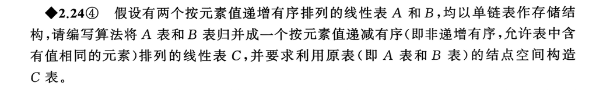

>归并排序。

```C++
void MergerList_L(LinkList &La,LinkList &Lb,LinkList &Lc){
    LNode *pa,*pb,*pc;
    pa = La->next;
    pb = Lb->next;
    Lc = pc = La;
    while(pa && pb){
        if(pa->data >= pb->data){
            pc->next = pa;
            pc = pa;
            pa = pa->next;
        }else{
            pc->next = pb;
            pc = pb;
            pb = pb->next;
        }
    }
    pc -> next = pa?pa:pb;
    free(Lb);
}
```


----

## 实验四

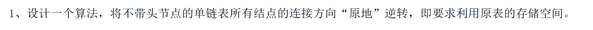

>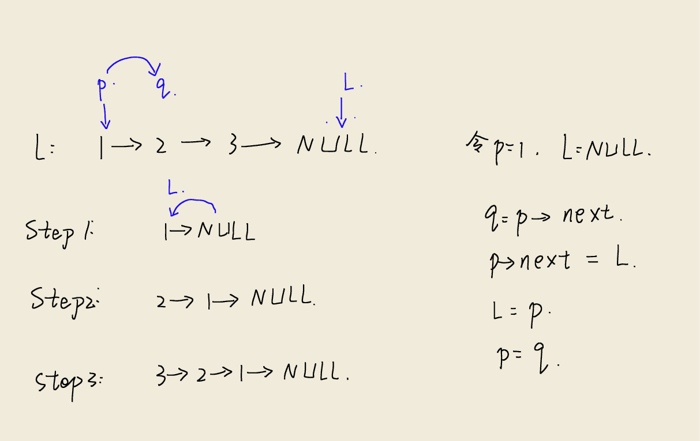
>
>​	用头插法将原链表的结点一次重新连接实现单链表的反转。
>
>- 首先需要定义临时指针`p`用于遍历原链表，`q`用于存储p的后继结点
>
>- 初始化`p`指向原链表第一个节点即`p = L`，反转后L链表头结点为`NULL`。
>
>- 接下来遍历p，每一次循环中，`L`始终指向反转后链表的首元素，而需要将原链表的当前元素插入到L中使之成为新的首元素。
>
>  因此我们先记录`q`的后继结点，然后更改`p`的后继结点，再更新`L`和`p`

```C++
void ReverseList_L(LinkList &L){
    LNode *p,*q;
    p = L;
    L = NULL;
    while(p){
        q = p->next;  // 暂存后继节点
        p->next = L;  // 将p链接在头结点之后
        L = p;  // 头结点指向新的头节点
        p = q;  // p后移
    }
}
```


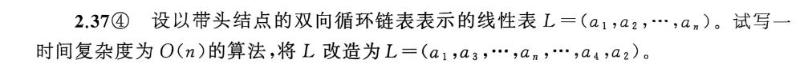

> 基本思路就是遍历线性表`L`，删除所有偶号位置的元素并将其重新连接（倒序）最后接到L尾部即可。

```C++
Status TransformList_DuL(DuLinkList &L) {
    if (L->next == L) { 
        printf("空链表无法改造\n");
        return ERROR;
    }

    DuLinkList p = L->next; 
    DuLinkList even_head = NULL; 
    DuLinkList even_tail = NULL; 

    while (p->next != L) { 
        DuLinkList q = p->next; 
        DuLinkList next_q = q->next; 

        // 将q从原链表中拆出
        p->next = next_q; 
        next_q->prior = p; 

        // 将q添加到偶数链的头部
        if (even_head == NULL) {
            even_head = q;
            even_tail = q;
            q->next = q; 
            q->prior = q;
        } else {
            q->next = even_head; 
            q->prior = even_head->prior;
            even_head->prior->next = q; 
            even_head->prior = q; 
            even_head = q;
        }

        // 移动p到下一个奇数节点
        if (next_q != L) {
            p = next_q;
        }
    }

    // 将偶数链连接到奇数链的末尾
    if (even_head != NULL) {
        p->next = even_head;
        even_head->prior = p;
        even_tail->next = L;
        L->prior = even_tail;
    }
    return OK;
}
```


>   ​	分析该题目，首先是查找操作，遍历链表找到相应位置并把该位置的元素频度域`ferq ++`；
>
>   ​	然后删除该结点，进行插入操作，插入的位置应满足其前一个结点的频度域不小于其频度域。

```C++
Status Locate_DuL(DuLinkList &L, ElemType x) {
    if (L->next == L) { 
        printf("空链表无法执行LOCATE操作\n");
        return ERROR;
    }
    DuLinkList target = NULL;
    DuLinkList p = L->next;
    while (p != L) {
        if (p->data == x) {
            target = p;
            break;
        }
        p = p->next;
    }
    if (target == NULL) {
        printf("未找到元素%d\n", x);
        return ERROR;
    }
    target->freq++;
    if (L->next == L->prior) {
        return OK;	//只有一个节点
    }
    // 删除target
    DuLinkList prev_old = target->prior; 
    DuLinkList next_old = target->next; 
    prev_old->next = next_old;           
    next_old->prior = prev_old;         
    // 找插入位置
    DuLinkList prev_insert = prev_old;
    while (prev_insert != L && prev_insert->freq < target->freq) {
        prev_insert = prev_insert->prior; 
    }
    // 插入
    target->next = prev_insert->next;      
    target->prior = prev_insert;         
    prev_insert->next->prior = target;    
    prev_insert->next = target;         
    return OK;
}
```


## 实验五

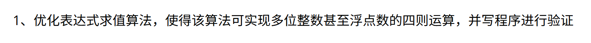

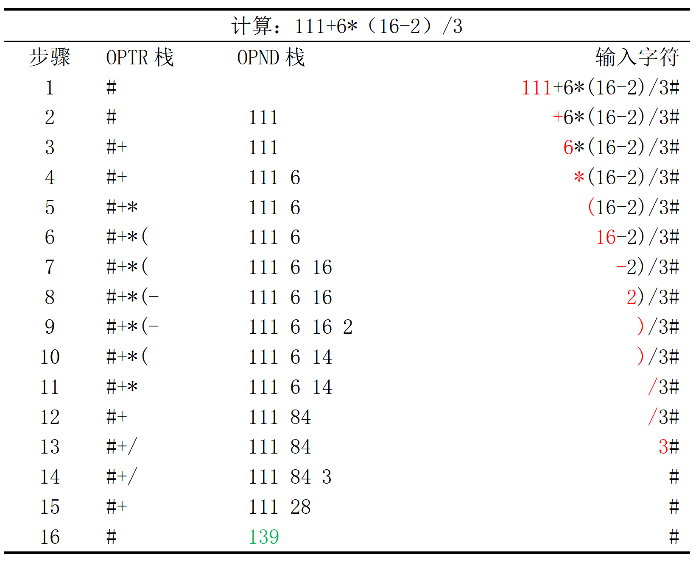

> - 首先需要定义两个栈`OPTR`和`OPND`分别存放字符和数字。
> - 根据表格分析对栈需要定义以下函数：初始化栈 `InitStack` ；获取栈顶元素`GetTop`；入栈`Push`；出栈`Pop`；

```C++
#include<iostream>
#include<cstdio>
#include<cstdlib>
#include<cctype>
#include<string>
using namespace std;

#define OK 1
#define ERROR 0
#define OVERFLOW -1
#define STACK_INIT_SIZE 100
#define STACKINCREMENT 10

typedef int Status;
typedef int ElemType;
typedef char SElemType;

// 操作数栈（整数）
typedef struct {
    ElemType *base;
    ElemType *top;
    int stacksize;
} IntStack;

// 运算符栈（字符）
typedef struct {
    SElemType *base;
    SElemType *top;
    int stacksize;
} OpStack;

// 获取运算符栈顶元素
Status GetTop(OpStack &S, SElemType &e) {
    if (S.top == S.base) return ERROR;
    e = *(S.top - 1);
    return OK;
}

// 获取操作数栈顶元素
Status GetTop(IntStack &S, ElemType &e) {
    if (S.top == S.base) return ERROR;
    e = *(S.top - 1);
    return OK;
}

// 初始化运算符栈
Status InitStack(OpStack &S) {
    S.base = (SElemType *)malloc(STACK_INIT_SIZE * sizeof(SElemType));
    if (!S.base) exit(OVERFLOW);
    S.top = S.base;
    S.stacksize = STACK_INIT_SIZE;
    return OK;
}

// 初始化操作数栈
Status InitStack(IntStack &S) {
    S.base = (ElemType *)malloc(STACK_INIT_SIZE * sizeof(ElemType));
    if (!S.base) exit(OVERFLOW);
    S.top = S.base;
    S.stacksize = STACK_INIT_SIZE;
    return OK;
}

// 运算符入栈
Status Push(OpStack &S, SElemType e) {
    if (S.top - S.base >= S.stacksize) {
        S.base = (SElemType *)realloc(S.base, (S.stacksize + STACKINCREMENT) * sizeof(SElemType));
        if (!S.base) exit(OVERFLOW);
        S.top = S.base + S.stacksize;
        S.stacksize += STACKINCREMENT;
    }
    *S.top++ = e;
    return OK;
}

// 操作数入栈
Status Push(IntStack &S, ElemType e) {
    if (S.top - S.base >= S.stacksize) {
        S.base = (ElemType *)realloc(S.base, (S.stacksize + STACKINCREMENT) * sizeof(ElemType));
        if (!S.base) exit(OVERFLOW);
        S.top = S.base + S.stacksize;
        S.stacksize += STACKINCREMENT;
    }
    *S.top++ = e;
    return OK;
}

// 运算符出栈
Status Pop(OpStack &S, SElemType &e) {
    if (S.top == S.base) return ERROR;
    e = *--S.top;
    return OK;
}

// 操作数出栈
Status Pop(IntStack &S, ElemType &e) {
    if (S.top == S.base) return ERROR;
    e = *--S.top;
    return OK;
}
```


> - 分析表格我们还需要对运算符的优先级进行比较，根据书本：
>
>   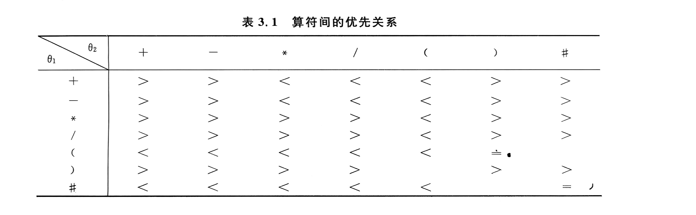
>
>   即对已在栈`OPTR`中的字符 $\theta_1$ 和即将入栈的字符$\theta_2$ 进行优先关系比较。
>
>   - 若为“ > ”则 $\theta_1$退栈并对`OPND`中的前两个数字进行运算，然后将$\theta_2$压入栈中。
>   - 如为" = "则消去括号。
>   - 若为“ < ”则$\theta_2$压入栈中。

```C++
// 运算符优先级映射
int opIndex(char op) {
    switch (op) {
        case '+': return 0;
        case '-': return 1;
        case '*': return 2;
        case '/': return 3;
        case '(': return 4;
        case ')': return 5;
        case '#': return 6;
        default: return -1;
    }
}

// 获取运算符优先级
char Precede(char a, char b) {
    // 优先级表 [行：栈顶运算符] [列：当前运算符]
    char precede[7][7] = {
        { '>', '>', '<', '<', '<', '>', '>' }, // +
        { '>', '>', '<', '<', '<', '>', '>' }, // -
        { '>', '>', '>', '>', '<', '>', '>' }, // *
        { '>', '>', '>', '>', '<', '>', '>' }, // /
        { '<', '<', '<', '<', '<', '=', '/' }, // (
        { '>', '>', '>', '>', '/', '>', '>' }, // )
        { '<', '<', '<', '<', '<', '/', '=' }  // #
    };
    int i = opIndex(a);
    int j = opIndex(b);
    if (i == -1 || j == -1) return '?';
    return precede[i][j];
}
```


> - 接着需要定义算数运算函数`Optrate`，即用于通过判断`theta`的符号进行不同的运算。

```C++
// 执行算术运算
ElemType Operate(ElemType a, char theta, ElemType b) {
    switch (theta) {
        case '+': return a + b;
        case '-': return a - b;
        case '*': return a * b;
        case '/': 
            if (b == 0) {
                exit(OVERFLOW);
            }
            return a / b;
        default:
            exit(OVERFLOW);
    }
}
```


> - 最后就是表达式求值核心函数`EvaluateExpression`

```C++
// 表达式求值
ElemType EvaluateExpression(string s) {
    OpStack OPTR;   
    IntStack OPND;  
    InitStack(OPTR);
    Push(OPTR, '#'); 
    
    InitStack(OPND);
    
    int i = 0;
    SElemType c = s[i++];
    SElemType topOp, x, theta;
    ElemType a, b;
    
    GetTop(OPTR, topOp);
    
    while (c != '#' || topOp != '#') {
        if (isdigit(c)) { 
            ElemType num = 0;
            while (i <= s.length() && isdigit(c)) {
                num = num * 10 + (c - '0');
                c = s[i++];
            }
            Push(OPND, num);
        } 
        else if (isspace(c)) { 
            c = s[i++];
        }
        else { 
            GetTop(OPTR, topOp);
            char relation = Precede(topOp, c);
            
            switch (relation) {
                case '<': 
                    Push(OPTR, c);
                    c = s[i++];
                    break;
                    
                case '=': 
                    Pop(OPTR, x); 
                    c = s[i++];
                    break;
                    
                case '>': 
                    Pop(OPTR, theta); 
                    Pop(OPND, b);     
                    Pop(OPND, a);     
                    Push(OPND, Operate(a, theta, b)); 
                    break;
            }
        }
        
        GetTop(OPTR, topOp);
    } 
    ElemType result;
    GetTop(OPND, result);
    free(OPTR.base);
    free(OPND.base);
    
    return result;
}

```

> 主函数如下：

```C++
int main() {
    string s;
    cout << "请输入表达式: ";
    getline(cin, s); 
    
    if (s.empty() || s.back() != '#') {
        s += '#';
    }
    
    ElemType result = EvaluateExpression(s);
    cout << "计算结果: " << result << endl;
    return 0;
}
```


## 实验六

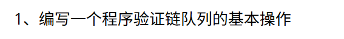

```C++
/*
 * @LastEditors  : Yygz314 2711859393@qq.com
 * @LastEditTime : 2025-10-27 13:52:57
 * @Author       : Yygz314
 * @Date         : 2025-10-27 13:16:52
 * @blog         : https://www.cnblogs.com/Yygz314
 */
#include<iostream>
#include<cstdio>
using namespace std;
#define OK 1
#define ERROR 0
#define OVERFLOW -1
#define LIST_INIT_SIZE 100
#define LISTINCREMENT 10

typedef int Status;
typedef int QElemType;

// 队列链式表示
typedef struct QNode{
    QElemType data;
    struct QNode *next;
}QNode,*QueuePtr;
typedef struct{
    QueuePtr front;
    QueuePtr rear;
}LinkQueue;

// 初始化队列
Status InitQueue(LinkQueue &Q){
    Q.front = Q.rear = (QueuePtr)malloc(sizeof(QNode));
    if(!Q.front) exit(OVERFLOW);
    Q.front->next=NULL;
    return OK;
}

// 销毁队列
Status DestroyQueue(LinkQueue &Q){
    while(Q.front){
        Q.rear = Q.front->next;
        free(Q.front);
        Q.front = Q.rear;
    }
    return OK;
}

// 入队
Status EnQueue(LinkQueue &Q, QElemType e){
    QueuePtr p = (QueuePtr) malloc (sizeof(QNode));
    if(!p) exit(OVERFLOW);
    if(!p) exit(OVERFLOW);
    p->data = e;
    p->next = NULL;
    Q.rear->next = p;
    Q.rear = p;
    return OK;
}

// 出队
Status DeQueue(LinkQueue &Q,QElemType &e){
    if(Q.front==Q.rear) return ERROR;
    QueuePtr p = Q.front->next;
    e = p->data;
    Q.front->next = p->next;
    if(Q.rear == p) Q.rear = Q.front;
    free(p);
    return OK;
}

//打印链表
void PrintQueue(LinkQueue Q){
    QueuePtr p = Q.front->next;
    while(p){
        cout<<p->data<<" ";
        p = p->next;
    }
    cout<<endl;
}

int main(){
    LinkQueue Q;
    InitQueue(Q);
    cout<<"初始化队列：";
    PrintQueue(Q);
    EnQueue(Q,1);
    EnQueue(Q,2);
    EnQueue(Q,3);
    EnQueue(Q,4);
    EnQueue(Q,5);
    cout<<"入队后队列为：";
    PrintQueue(Q);
    QElemType e;
    DeQueue(Q,e);
    cout<<"出队元素为："<<e<<endl;
    DeQueue(Q,e);
    cout<<"出队元素为："<<e<<endl;
    cout<<"出队后队列为：";
    PrintQueue(Q);
    DestroyQueue(Q);
    cout<<"销毁后队列:";
    PrintQueue(Q);
    return 0;
}
```

## 实验七

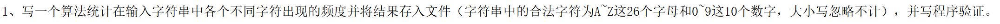

>  用一个数组统计对应的字符数量，然后定义一个字符串遍历即可。

```c++
#include <cstdio>
#include <cstring>
#include <cstdlib>
using namespace std;

#define OK 1
#define ERROR 0
#define OVERFLOW -1
#define MAXSTRLEN 255 

int SScount[36] = {0}; 

// 字符串结构体
typedef struct {
    char* ch;    
    int length;  
} HString;


void StrAssign(HString& T, const char* s) {
    if (T.ch != NULL) {
        delete[] T.ch;
        T.ch = NULL;
        T.length = 0;
    }
    // 分配新空间
    T.length = strlen(s);
    T.ch = new char[T.length + 1]; 
    if (T.ch == NULL) {
        exit(OVERFLOW);
    }
    strcpy(T.ch, s); // 复制字符串
}

void SS_count(const HString& T) {
    for (int i = 0; i < T.length; i++) {
        char ch = T.ch[i];
        if (ch >= 'a' && ch <= 'z') {
            SScount[ch - 'a']++; 
        } else if (ch >= 'A' && ch <= 'Z') {
            SScount[ch - 'A']++; 
        } else if (ch >= '0' && ch <= '9') {
            SScount[ch - '0' + 26]++; 
        }else{
            continue;
        }
    }
}

void PrintToConsole() {
    printf("\n字符频率统计\n");
    for (int i = 0; i < 26; i++) {
        if (SScount[i] != 0) {
            printf("%c: %d次\n", 'a' + i, SScount[i]);
        }
    }
    for (int i = 26; i < 36; i++) {
        if (SScount[i] != 0) {
            printf("%c: %d次\n", '0' + (i - 26), SScount[i]);
        }
    }
}

//写入文件
void SaveToFile(const char* filename) {
    FILE* fp = fopen(filename, "w");
    if (fp == NULL) {
        perror("无法打开文件");
        return;
    }
    fprintf(fp, "字符频率统计\n");
    for (int i = 0; i < 26; i++) {
        if (SScount[i] != 0) {
            fprintf(fp, "%c: %d次\n", 'a' + i, SScount[i]);
        }
    }
    for (int i = 26; i < 36; i++) {
        if (SScount[i] != 0) {
            fprintf(fp, "%c: %d次\n", '0' + (i - 26), SScount[i]);
        }
    }
    fclose(fp);
    printf("结果已写入文件：%s\n", filename);
}

int main() {
    HString T;
    T.ch = NULL; 
    T.length = 0;
    char input[MAXSTRLEN] = {0}; 
    char c;
    int idx = 0;
    printf("请输入字符串（停止输入请输入#）：");
    while ((c = getchar()) != '#' && idx < MAXSTRLEN - 1) {
        input[idx++] = c;
    }
    input[idx] = '\0';
    if (idx == 0) {
        printf("未输入任何字符！\n");
        return ERROR;
    }
    StrAssign(T, input);
    SS_count(T);
    PrintToConsole();
    SaveToFile("result.txt");

    if (T.ch != NULL) {
        delete[] T.ch;
        T.ch = NULL;
    }
    return OK;
}
```


